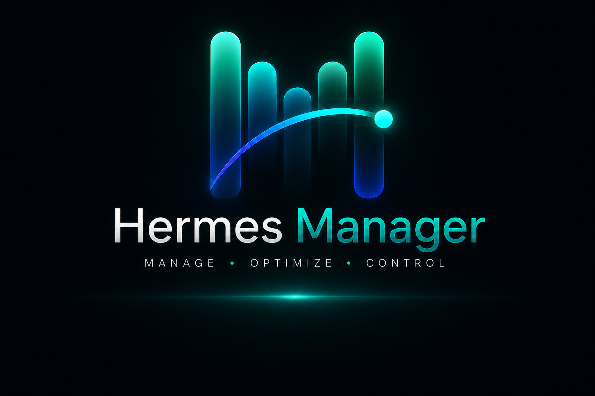
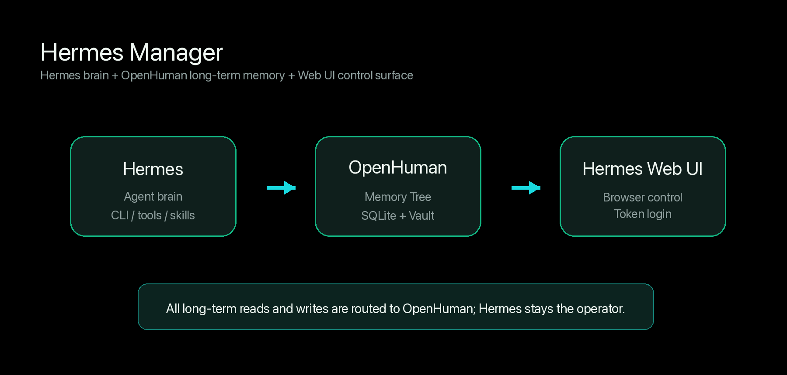
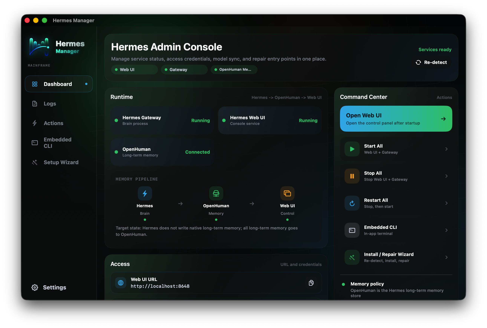

  

  <strong>A macOS control console for installing, connecting, and managing Hermes + OpenHuman + Hermes Web UI.</strong>

  <a href="README.md">中文</a> |
  English

  
  
  
  

## What is Hermes Manager?

Hermes Manager is a macOS installer and control console for a local Hermes + OpenHuman stack. It installs Hermes, installs OpenHuman, configures the long-term memory bridge, then starts Hermes Web UI and an embedded Hermes CLI.

The product idea is simple: Hermes handles agent orchestration and tool execution, OpenHuman owns long-term memory, and Hermes Web UI provides the browser control surface.

## Why Hermes + OpenHuman?

Hermes is strong at agent orchestration: conversations, tool execution, CLI workflows, model runtime, and task control live there. OpenHuman is strong as a long-term memory layer, with a local-first workspace, structured memory storage, and durable recall.

Hermes Manager combines them:

- Hermes keeps orchestration, tool execution, and the CLI experience.
- OpenHuman handles long-term memory reads and writes.
- Hermes native long-term memory writes are disabled to avoid splitting memory across backends.
- Hermes Web UI becomes the browser console for access, token login, and service control.
- Migration only moves Hermes long-term memory; short-term logs stay local.

  

## Highlights

- One-click setup for Hermes, OpenHuman, and Hermes Web UI.
- Automatic local state detection with four flows: fresh install, OpenHuman add-on, memory bridge repair, and already configured.
- Automatic Hermes -> OpenHuman memory bridge configuration.
- Migration of existing Hermes long-term memory into OpenHuman without overwriting existing OpenHuman data.
- Detection that Hermes native long-term memory writes are disabled.
- Web UI URL and login token detection, with token hidden by default.
- Embedded Hermes CLI inside the app.
- Dashboard controls for starting, stopping, and restarting Web UI and Gateway.
- Chinese / English UI switching.
- Developer-maintained remote version manifest to avoid unsafe "latest" updates.

## Screenshots

### Setup Wizard

The setup wizard detects the local machine state and exposes only the matching install or repair flow.

  

### Dashboard

The dashboard brings service status, Web UI access, login token controls, model status, and install/repair entry points into one place.

  

## Quick Start

1. Download `HermesManager-macOS.dmg` from GitHub Releases.
2. Open the DMG and drag `HermesManager.app` into `/Applications`.
3. On first launch, choose the single enabled setup or repair card.
4. Wait for the run to complete.
5. Optional: enter an OpenAI-compatible API base URL, API key, and model name.
6. Open Hermes Web UI or use the embedded Hermes CLI inside the app.

If macOS says the app is damaged or cannot be opened, see [Troubleshooting](docs/TROUBLESHOOTING.en.md).

## Docs

- [Installation Guide](docs/INSTALL.en.md)
- [Troubleshooting](docs/TROUBLESHOOTING.en.md)
- [Development Guide](docs/DEVELOPMENT.en.md)

## Current Status

Hermes Manager is currently a macOS preview build. It prefers a developer-tested Hermes / OpenHuman / Hermes Web UI combination instead of installing the newest upstream release directly. Later updates are checked inside the app through the Update Center.

## Privacy and Safety

- Hermes Manager is local-first and does not upload your memory, token, or model configuration.
- Public releases do not include the maintainer's local memory, API keys, GitHub tokens, or private config.
- Install logs avoid printing API keys, tokens, and memory contents.
- The remote update manifest can select versions, refs, and download URLs only; it cannot execute arbitrary commands.

## Acknowledgements

Hermes Manager is an integration project built on top of:

- [Hermes Agent](https://github.com/NousResearch/hermes-agent) - agent orchestration, CLI, and tool runtime.
- [OpenHuman](https://github.com/tinyhumansai/openhuman) - long-term memory, user modeling, and local memory workspace.
- [Hermes Web UI](https://www.npmjs.com/package/hermes-web-ui) - browser control console and login surface.

Thank you to the authors and maintainers of these projects.

## License

MIT. See [LICENSE](LICENSE).
