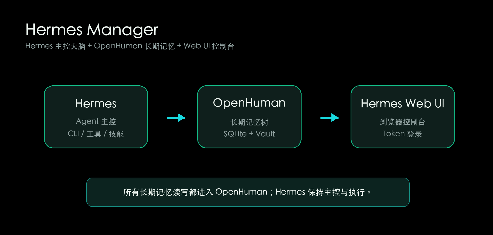
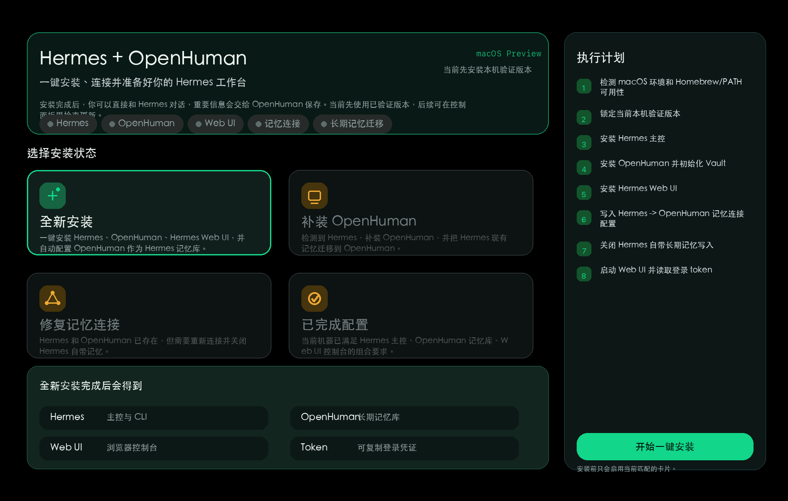
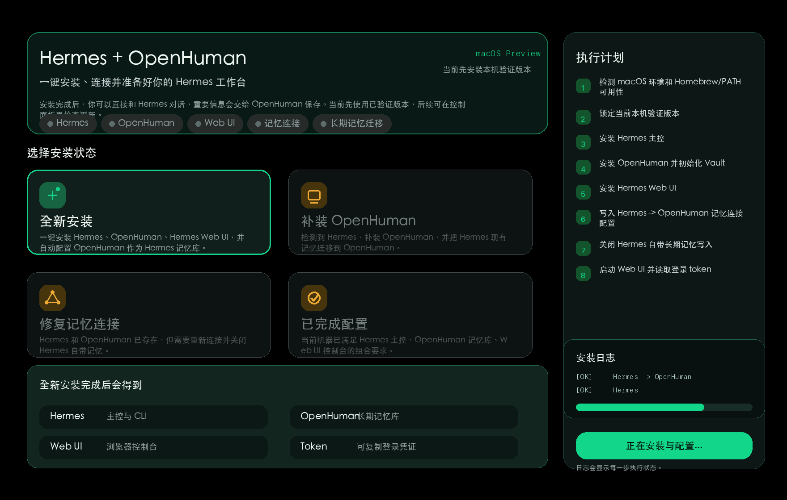

  

  <strong>一键安装、连接并管理 Hermes + OpenHuman + Hermes Web UI 的 macOS 控制台。</strong>

  中文 |
  <a href="README.en.md">English</a>

  
  
  
  

## Hermes Manager 是什么？

Hermes Manager 是一个面向普通 macOS 用户的安装器与控制台。它把三件事做成一个可视化流程：安装 Hermes，安装 OpenHuman，把 OpenHuman 配置为 Hermes 的长期记忆库，再启动 Hermes Web UI 和内置 Hermes CLI。

目标很简单：让 Hermes 专注做主控大脑，让 OpenHuman 专注做长期记忆，让 Hermes Web UI 提供浏览器控制台。

## 为什么是 Hermes + OpenHuman？

Hermes 擅长作为 agent 主控：对话、工具调用、CLI 工作流、模型运行和任务执行都由它负责。OpenHuman 擅长长期记忆：它提供本地优先的记忆工作区、结构化记忆存储和可持续召回能力。

Hermes Manager 把两者接在一起：

- Hermes 保留主控、工具和 CLI 体验。
- OpenHuman 接管长期记忆读写。
- Hermes 原生长期记忆写入会被关闭，避免同一份长期记忆分散到多个库。
- Hermes Web UI 作为控制平台，负责浏览器访问、token 登录和服务入口。
- 迁移时只迁移 Hermes 长期记忆，短期会话日志保留在本地。

  

## 功能亮点

- 一键安装 Hermes、OpenHuman 和 Hermes Web UI。
- 自动检测本机安装状态，按“全新安装 / 补装 OpenHuman / 修复记忆连接 / 已完成配置”展示流程。
- 自动配置 Hermes 使用 OpenHuman 作为长期记忆库。
- 迁移 Hermes 现有长期记忆到 OpenHuman，且不覆盖 OpenHuman 已有数据。
- 检测 Hermes 自带长期记忆是否已关闭。
- 检测 Web UI 地址和登录 token，默认隐藏敏感 token。
- 内置 Hermes CLI，不需要另开终端。
- 控制台可启动、停止、重启 Web UI 与 Gateway。
- 中英文界面切换。
- 开发者控制的远程版本清单，避免用户自动追最新版导致兼容问题。

## 截图

### 全新安装流程

  

### 安装与配置

  

## 快速开始

1. 从 GitHub Releases 下载 `HermesManager-macOS.dmg`。
2. 打开 DMG，把 `HermesManager.app` 拖到 `/Applications`。
3. 第一次打开后，根据检测结果选择唯一可用的安装/修复卡片。
4. 等待执行完成。
5. 可选：填写 OpenAI 兼容 API Base URL、API Key 和模型名称。
6. 打开 Web UI，或在 App 内进入 Hermes CLI。

如果 macOS 提示应用无法打开，请看 [常见问题排查](docs/TROUBLESHOOTING.zh-CN.md)。

## 文档

- [安装指南](docs/INSTALL.zh-CN.md)
- [常见问题排查](docs/TROUBLESHOOTING.zh-CN.md)
- [开发指南](docs/DEVELOPMENT.zh-CN.md)

## 当前状态

Hermes Manager 当前是 macOS 预览版。它优先安装开发者验证过的 Hermes / OpenHuman / Hermes Web UI 组合，而不是盲目安装上游最新版。后续可在 App 内更新中心检查开发者确认过的新版本。

## 隐私与安全

- Hermes Manager 默认使用本机路径，不上传你的记忆、token 或模型配置。
- 公开版不会包含作者本机记忆、API Key、GitHub token 或私有配置。
- 安装日志会避免打印 API Key、Token 和记忆正文。
- 更新清单只能选择版本、下载链接和组件 ref；不会从远程执行任意命令。

## 致谢

Hermes Manager 是一个集成器项目，离不开这些上游项目：

- [Hermes Agent](https://github.com/NousResearch/hermes-agent) - agent 主控、CLI 和工具运行体验。
- [OpenHuman](https://github.com/tinyhumansai/openhuman) - 长期记忆、用户画像和本地记忆工作区。
- [Hermes Web UI](https://www.npmjs.com/package/hermes-web-ui) - Web 控制台与浏览器入口。

感谢这些项目作者和维护者的贡献。

## License

MIT. See [LICENSE](LICENSE).
