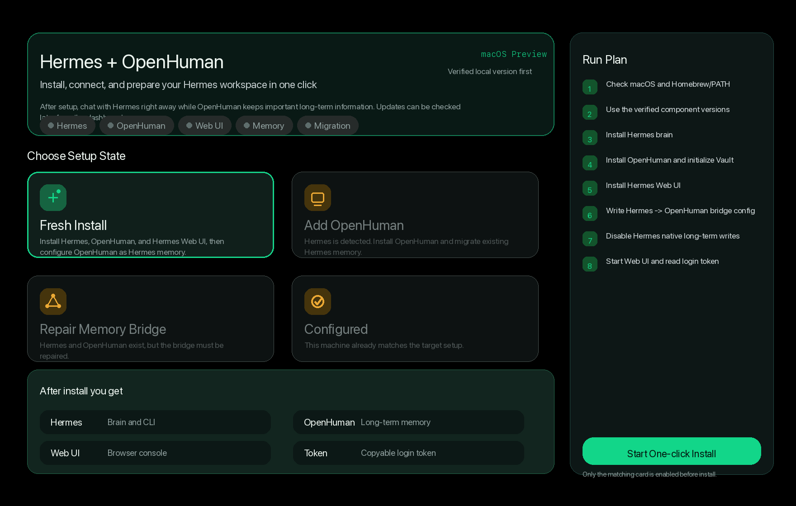
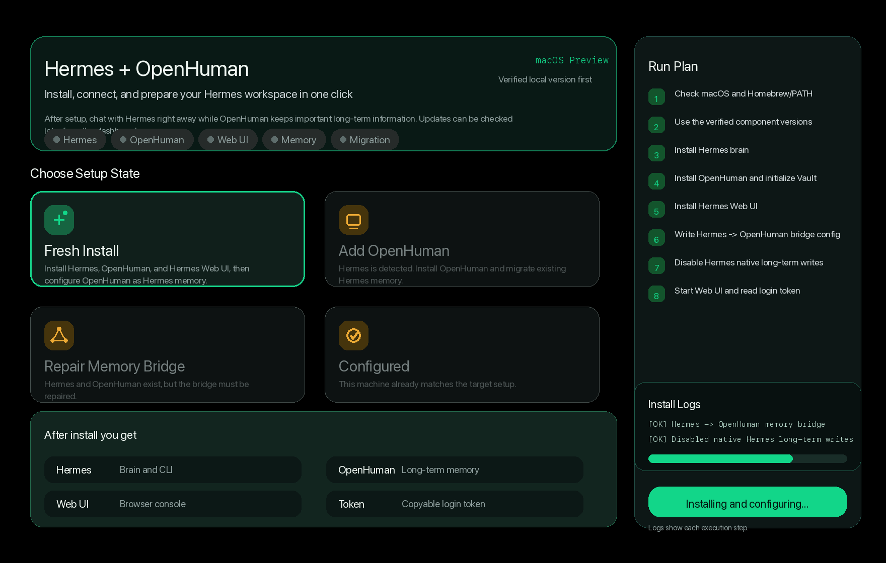
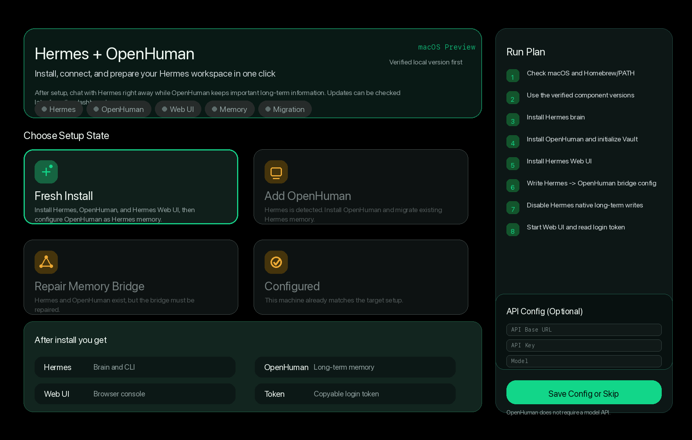
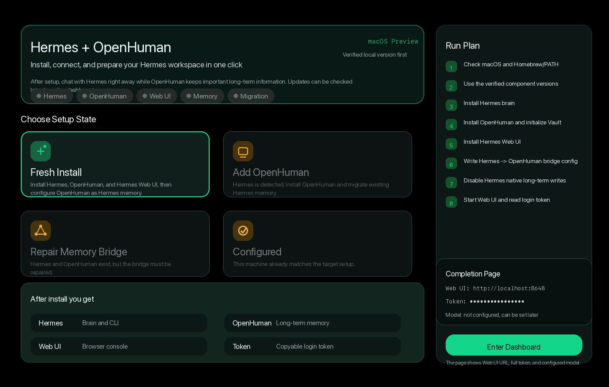

# Installation Guide

[中文](INSTALL.zh-CN.md) | [English](INSTALL.en.md)

## Requirements

- macOS 14 or later.
- Apple Silicon Mac recommended.
- Network access to GitHub/npm.
- Optional: an OpenAI-compatible API base URL, API key, and model name for model usage.

## Install Hermes Manager

1. Download `HermesManager-macOS.dmg`.
2. Open the DMG.
3. Drag `HermesManager.app` into `/Applications`.
4. Launch Hermes Manager from `/Applications`.

If macOS blocks the app, see [Troubleshooting](TROUBLESHOOTING.en.md).

## First Launch: Fresh Install Flow

Hermes Manager automatically detects the local machine state and enables only the matching card. A clean machine enters the fresh install flow: Hermes, OpenHuman, and Hermes Web UI are installed with developer-tested versions and connected automatically.

- Fresh install: Hermes, OpenHuman, and Hermes Web UI are missing.
- Add OpenHuman: Hermes exists, OpenHuman should be installed, and Hermes long-term memory should be migrated.
- Repair memory bridge: Hermes and OpenHuman exist but are not connected correctly.
- Already configured: Hermes brain, OpenHuman memory, and Web UI console are ready.

### 1. Choose Fresh Install

Confirm that “Fresh Install” is highlighted, then click “Start One-click Install”.

  

### 2. Wait for Install and Bridge Setup

The run page shows logs and progress. This stage installs Hermes, OpenHuman, Hermes Web UI, then writes the Hermes -> OpenHuman memory bridge config.

  

### 3. Optional: Configure Model API

After setup, enter an OpenAI-compatible API base URL, API key, and model name if you already have one. You can also skip this step. OpenHuman does not need a model API; it acts as the long-term memory backend.

  

### 4. Enter the Completion Page

The completion page shows the Web UI URL, login token, and model status. The token should stay hidden by default until the user chooses to copy it.

  

## Memory Strategy

Hermes Manager migrates Hermes long-term memory only. Short-term conversations, logs, caches, and temporary state remain local.

Migration writes into OpenHuman's local memory workspace and uses deduplication to avoid overwriting existing OpenHuman memory.

## Runtime Behavior

After setup:

- Opening Hermes Manager starts the app-managed Web UI / Gateway processes.
- Quitting Hermes Manager stops child processes launched by the app.
- You can open Web UI or the embedded Hermes CLI from inside the app.

## Update Policy

Hermes Manager installs developer-tested component versions by default instead of blindly tracking the newest upstream release. Use the Settings Update Center when you want to update.
