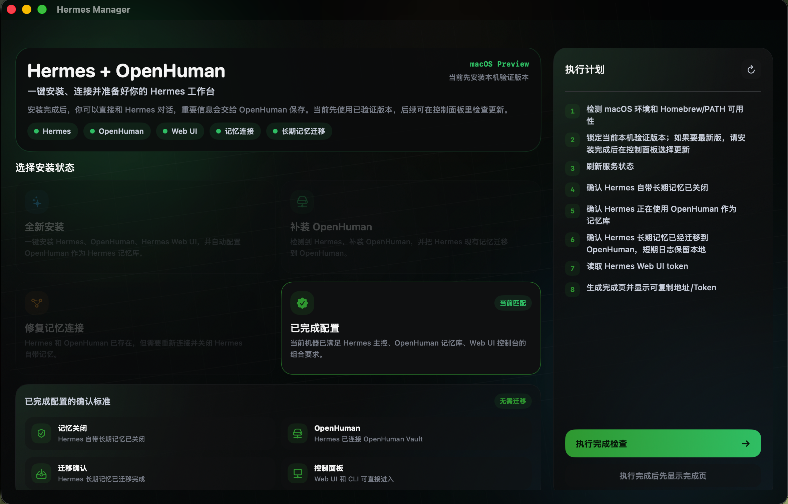

# 安装指南

[中文](INSTALL.zh-CN.md) | [English](INSTALL.en.md)

## 系统要求

- macOS 14 或更高版本。
- Apple Silicon Mac 推荐。
- 可以访问 GitHub/npm 的网络环境。
- 如果需要模型对话，请准备一个 OpenAI 兼容 API Base URL、API Key 和模型名称。

## 安装 Hermes Manager

1. 下载 `HermesManager-macOS.dmg`。
2. 打开 DMG。
3. 将 `HermesManager.app` 拖到 `/Applications`。
4. 从 `/Applications` 打开 Hermes Manager。

如果 macOS 阻止打开，请看 [常见问题排查](TROUBLESHOOTING.zh-CN.md)。

## 第一次启动

Hermes Manager 会自动检测本机状态，并只允许点击当前匹配的卡片：

- 全新安装：Hermes、OpenHuman、Hermes Web UI 都未安装。
- 补装 OpenHuman：已有 Hermes，需要安装 OpenHuman 并迁移 Hermes 长期记忆。
- 修复记忆连接：Hermes 和 OpenHuman 已存在，但还没有正确连接。
- 已完成配置：Hermes 主控、OpenHuman 记忆库、Web UI 控制台已经满足要求。

  

## 记忆迁移策略

Hermes Manager 只迁移 Hermes 长期记忆。短期会话、运行日志、缓存和临时状态会保留在本地，不会强行写入 OpenHuman。

迁移会写入 OpenHuman 的本地记忆工作区，并使用去重策略避免覆盖已有 OpenHuman 记忆。

## API 配置

安装完成后，你可以选择配置 OpenAI 兼容模型：

- API Base URL
- API Key
- 模型名称

如果暂时不配置，也可以跳过。OpenHuman 不需要模型 API，它只作为长期记忆后端。

## 启动方式

配置完成后：

- 打开 Hermes Manager 会自动启动由 App 管理的 Web UI / Gateway。
- 关闭 Hermes Manager 会停止由 App 启动的子进程。
- 你可以在 App 内打开 Web UI 或内置 Hermes CLI。

## 更新策略

Hermes Manager 默认安装开发者验证过的版本组合，不会盲目追随上游最新版。需要更新时，请在 App 的设置页进入更新中心。
