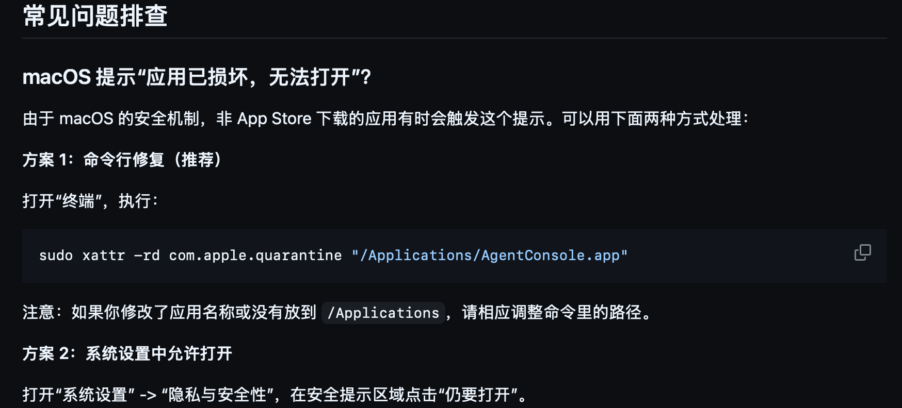

# 常见问题排查

[中文](TROUBLESHOOTING.zh-CN.md) | [English](TROUBLESHOOTING.en.md)

## macOS 提示“应用已损坏，无法打开”？

由于 Hermes Manager 目前不是 App Store 分发，macOS 可能会给非公证应用加上隔离标记。

方案 1：命令行修复（推荐）

```bash
sudo xattr -rd com.apple.quarantine "/Applications/HermesManager.app"
```

方案 2：系统设置中允许打开

打开“系统设置” -> “隐私与安全性”，在安全提示区域点击“仍要打开”。

<p align="center">
  
</p>

## 打开后还是旧界面？

请确认 `/Applications/HermesManager.app` 是最新版本。可以删除旧 App 后重新从 DMG 拖入 `/Applications`。

```bash
rm -rf "/Applications/HermesManager.app"
```

然后重新安装。

## 检测不到 Hermes / OpenHuman？

请确认命令行环境里能找到对应工具，或者确认它们的本地目录存在。Hermes Manager 会优先检测：

- `hermes`
- `openhuman`
- `~/.hermes`
- `~/.openhuman`

如果你使用了自定义安装位置，请先通过 Hermes Manager 的安装/修复向导重新检测。

## Web UI 地址打不开？

先在控制台点击“启动全部”或“重启全部”。如果端口被占用，请关闭其他占用 Hermes Web UI 端口的进程后重试。

## 登录 Token 没显示？

Hermes Manager 会自动检测多个常见 token 路径。Token 默认隐藏，点击眼睛按钮显示，点击复制按钮复制。

## 记忆连接显示需要修复？

这通常表示其中一项不满足：

- Hermes 没有配置 OpenHuman provider。
- OpenHuman 工作区不存在。
- Hermes 原生长期记忆还没有关闭。
- Hermes 长期记忆尚未迁移到 OpenHuman。

请进入“安装 / 修复向导”执行自动修复。
